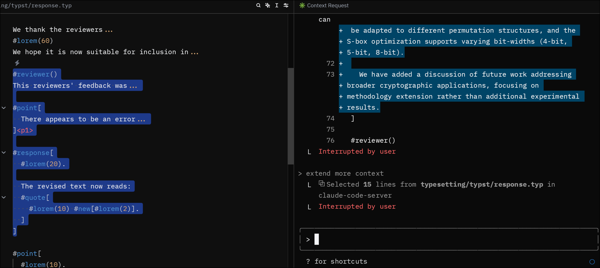

# Claude Code Zed Integration

A two-part system that integrates Claude Code CLI with Zed editor for AI-assisted coding.



## Current Integration Status

### ✅ Working Features
- **Text Selection Sharing**: Zed can send selected text context to Claude Code CLI
- **File Reference Handling**: Selected code snippets and file paths are transmitted
- **WebSocket Communication**: Stable connection between Zed and Claude Code CLI

### 🚧 Limitations
- **LSP Diagnostics**: Currently NOT implemented - Zed extension works as LSP client but doesn't expose IDE diagnostic information (errors, warnings, type hints) to Claude Code CLI
- **One-way Communication**: Primary flow is Zed → Claude Code; limited Claude Code → Zed capabilities

## Installation

### Prerequisites
- Zed editor
- Claude Code CLI

### Setup

1. **Clone the repository**:
   ```bash
   git clone https://github.com/jiahaoxiang2000/claude-code-zed.git
   ```

2. **Install the Zed extension** (Development Mode):
   - Open Zed editor
   - Press `Cmd+Shift+P` (macOS) or `Ctrl+Shift+P` (Linux/Windows) to open the command palette
   - Type "zed: install dev extension" and select it
   - Navigate to and select the `claude-code-extension` folder in your cloned repository
   - The extension will be installed and activated automatically

3. **The claude-code-server is automatically downloaded**:
   - The extension will automatically download the appropriate `claude-code-server` binary from GitHub releases
   - No manual build or installation of the server is required
   - The server binary is cached in the extension's working directory

### Supported Platforms
- **macOS**: Intel (x86_64) and Apple Silicon (aarch64)
- **Linux**: x86_64
- **Windows**: Not currently supported

### Language Server Activation

The Claude Code extension runs as a Language Server Protocol (LSP) server and automatically activates when you open files with the following extensions:

- **Rust** (`.rs`)
- **JavaScript** (`.js`)
- **TypeScript** (`.ts`, `.tsx`)
- **Python** (`.py`)
- **Markdown** (`.md`)

#### Adding Support for Other File Types

To enable Claude Code integration for additional file types, edit the `claude-code-extension/extension.toml` file:

```toml
[language_servers.claude-code-server]
name = "Claude Code Server"
languages = ["Rust", "JavaScript", "TypeScript", "Python", "Markdown", "Go", "Java"]

[language_servers.claude-code-server.language_ids]
"Rust" = "rust"
"JavaScript" = "javascript"
"TypeScript" = "typescript"
"Python" = "python"
"Markdown" = "markdown"
"Go" = "go"
"Java" = "java"
```

After modifying the configuration, reinstall extention and restart Zed for the changes to take effect.

## Usage

Once the extension is installed, follow these steps to connect Claude Code CLI with Zed:

### Connecting Claude Code to Zed

1. **Open a supported file in Zed**: Create or open a file with one of the supported extensions (`.rs`, `.js`, `.ts`, `.tsx`, `.py`, `.md`)

2. **Start Claude Code CLI**: Open your terminal and run:
   ```bash
   claude-code
   ```

3. **Enable IDE integration**: In Claude Code CLI, run:
   ```
   /ide
   ```

4. **Select the integration**: Choose `claude-code-server` from the menu that appears

5. **Test the connection**: 
   - Select some text in your Zed editor
   - In Claude Code CLI, ask: "What did I select?"
   - If connected properly, Claude should be able to see your selected text

### What to Expect

Once connected, you'll have:
- **Text selection sharing**: Selected text in Zed is automatically available to Claude Code CLI
- **File context**: Claude can see which file you're working in
- **Real-time updates**: Changes in your selection are immediately reflected in Claude

### Verifying the Connection

To confirm everything is working:
- Check for a lock file at `~/.claude/ide/[port].lock`
- The Claude Code CLI will display IDE integration status
- Text selections in Zed should be visible to Claude Code CLI

## Architecture Overview

This project consists of two components:

### 1. Zed Extension (`claude-code-zed`)
- **Purpose**: Zed editor integration and LSP communication
- **Technology**: Rust compiled to WebAssembly
- **Responsibilities**:
  - Editor selection tracking
  - File reference handling
  - LSP server lifecycle management
  - Communication with the companion server

### 2. Claude Code Server (`claude-code-server`)
- **Purpose**: WebSocket server for Claude Code CLI communication
- **Technology**: Native Rust application
- **Responsibilities**:
  - WebSocket server on localhost
  - Lock file management (`~/.claude/ide/[port].lock`)
  - Authentication token handling
  - JSON-RPC protocol implementation
  - Bridging between Zed extension and Claude Code CLI

## How It Works

The system implements the Claude Code protocol as documented in [claudecode.nvim PROTOCOL.md](https://github.com/coder/claudecode.nvim/blob/main/PROTOCOL.md):

### Communication Flow

1. **Zed Extension Startup**:
   - Extension loads in Zed's WASM environment
   - Establishes LSP connection to companion server
   - Begins tracking editor selections and file changes

2. **Companion Server Launch**:
   - `claude-code-server` starts as native process
   - Creates WebSocket server on random port (10000-65535)
   - Writes discovery lock file to `~/.claude/ide/[port].lock`
   - Sets environment variables (`CLAUDE_CODE_SSE_PORT`, `ENABLE_IDE_INTEGRATION`)

3. **Claude Code Discovery**:
   - Claude Code CLI discovers server via lock file
   - Authenticates using UUID token from lock file
   - Establishes WebSocket connection

4. **Bidirectional Communication**:
   - **Zed → Claude**: Selection changes, file references via LSP → Server → WebSocket
   - **Claude → Zed**: MCP tool calls via WebSocket → Server → LSP → Extension

### Component Interaction

```
Zed Editor (WASM)  ←→  LSP  ←→  Native Server  ←→  WebSocket  ←→  Claude Code CLI
     │                              │
     └── Selection tracking         └── Protocol implementation
     └── File references            └── Lock file management
     └── WASM-safe operations       └── Full system access
```

## Protocol Implementation

### Messages from Zed to Claude Code

- `selection_changed`: Notifies Claude when text selection changes

## FAQ & Troubleshooting

### Q: I'm getting a "Failed to compile Rust extension" error when installing

**A:** This error typically occurs when Zed cannot compile the Rust extension to WebAssembly. Here are the solutions:

#### Solution 1: Ensure you have the required Rust toolchain
Make sure you have Rust installed with the `wasm32-wasi` target:

```bash
# Install Rust if you haven't already
curl --proto '=https' --tlsv1.2 -sSf https://sh.rustup.rs | sh

# Add the WebAssembly target
rustup target add wasm32-wasi
```

#### Solution 2: Install the extension through Zed's extension manager (Recommended)
Instead of installing from source, try installing the published extension:

- Open Zed editor
- Press `Cmd+Shift+P` (macOS) or `Ctrl+Shift+P` (Linux/Windows) to open the command palette
- Type "zed: install dev extension" and select it
- Navigate to and select the `claude-code-extension` folder in your cloned repository
- The extension will be installed and activated automatically

#### Solution 3: Manual compilation check
If you need to install from source, verify the extension compiles correctly:

```bash
cd claude-code-extension
cargo check --target wasm32-wasi
```

If this fails, check that your Rust toolchain is up to date:
```bash
rustup update
```

#### Solution 4: macOS-specific installation using Homebrew
For macOS users who encounter issues with the standard Rust installation, use Homebrew:

```bash
# Install rustup through Homebrew
brew install rustup-init

# Run rustup-init to complete the installation
rustup-init

# Add Cargo bin directory to your PATH
echo 'export PATH="$HOME/.cargo/bin:$PATH"' >> ~/.zshrc

# Reload your shell configuration
source ~/.zshrc

# Add the WebAssembly target
rustup target add wasm32-wasi
```

After installation, restart your terminal and try installing the Zed extension again.

#### Solution 5: Clear Zed's extension cache
Sometimes clearing the extension cache helps:

1. Close Zed completely
2. Remove the extension cache (location varies by OS):
   - **macOS**: `~/Library/Application Support/Zed/extensions`
   - **Linux**: `~/.local/share/zed/extensions`
3. Restart Zed and try installing again

### Q: The extension installs but doesn't seem to work

**A:** Check the following:

1. **Verify the extension is active**: Look for "Claude Code Server" in Zed's language server status
2. **Check supported file types**: The extension only activates for `.rs`, `.js`, `.ts`, `.tsx`, `.py`, and `.md` files
3. **Restart Zed**: Sometimes a restart is needed after installation
4. **Check logs**: Open Zed's developer console to see any error messages

### Q: How do I know if Claude Code CLI is connected?

**A:** When properly connected, you should see:

1. A lock file created at `~/.claude/ide/[port].lock`
2. The Claude Code CLI will show IDE integration status
3. Text selections in Zed will be visible to Claude Code CLI

If you continue experiencing issues, please [open an issue](https://github.com/jiahaoxiang2000/claude-code-zed/issues) with your error details and system information.